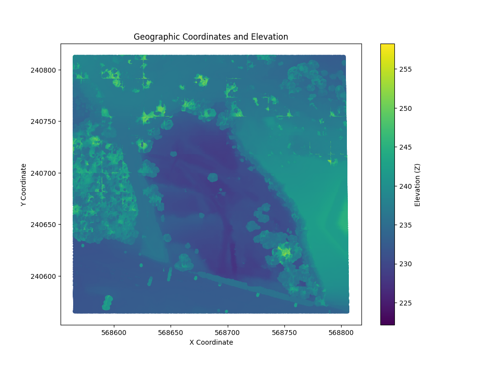
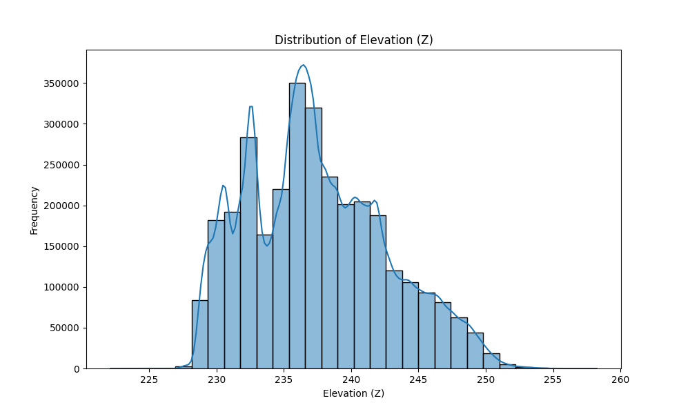

## Markdown 

Markdown is a lightweight markup language for formatting plain text using simple syntax, allowing easy conversion to HTML or other rich text formats. It's commonly used for documentation, web content, and writing readable text files like README files on platforms such as GitHub.

[A little more information about Markdown.](https://www.markdownguide.org/extended-syntax/)

## Markdown Syntax

Markdown allows for formatting documents in a simple and readable way. For example, one can start with a main header to give the document a title, and then add a few paragraphs with bold and italicized text for emphasis. Lists can be included, links to websites can be added, and even images can be embedded. If there is a need to share code snippets, Markdown makes this clear, ensuring that they are easy to read and understand.
The combination of these features allows for the creation of well-organized, structured, and visually appealing documents that can be easily converted to HTML or other formats for use on websites, in reports, or in presentations. 

## Overview

The plot below shows the geographic coordinates with the elevation data represented by color.



## Plot 1

To recreate the plot 1, use the Python script provided below:

```python
import pandas as pd
import matplotlib.pyplot as plt

file_path = r'C:\Users\Python\projekty\python_proj\data.csv'

df = pd.read_csv(file_path)

x = df['X']
y = df['Y']
z = df['Z']

plt.figure(figsize=(10, 8))
plt.scatter(x, y, c=z, cmap='viridis', s=10)
plt.colorbar(label='Elevation (Z)')
plt.xlabel('X Coordinate')
plt.ylabel('Y Coordinate')
plt.title('Geographic Coordinates and Elevation')
```

# Scatterplot Analysis

The scatterplot illustrates the distribution of points in the geographical space. The X and Y axes represent geographical coordinates, while the colors indicate elevation values. The area covered by colors from light blue to green suggests variations in elevation, indicating diverse terrain.

## Height (Z)

The color gradient (from darker blue to bright green) indicates changes in elevation. On the color scale (right side of the plot), Z values range from about 225 to 255. Observations include:

- **Light green areas** indicate higher values (above 250).
- **Darker areas** represent lower values (below 230).

## High and Low Areas

- **High Areas**: The upper section of the plot shows a clear cluster of light colors, suggesting the presence of higher terrain.
- **Low Areas**: The lower section of the plot displays darker shades, indicating regions of lower elevation.

## Terrain Structure

The clarity and variability of colors may suggest the presence of various terrain formations, such as hills, valleys, or plateaus. There may also be small water bodies or other geographical features affecting local conditions.

## Potential Anomalies

Attention should be given to any outlier points that may indicate unusual geographical conditions. Investigating points with disproportionately high or low values can provide insights into underlying factors.

## Clustering

Noticeable clusters of points may suggest data groupings with similar characteristics, which could be of interest for urban or ecological analysis.

# Conclusions

- **Elevation Variability**: The area presents elevation variability, which may be significant for spatial planning, environmental protection, or geological studies.
- **Understanding Terrain**: This analysis could be useful for further research, particularly in applications involving ecology, agriculture, or urbanization.
- **Z Values as Indicators**: Z values may highlight areas requiring further analysis, such as water resource management or flood protection.



## Statistics

## Descriptive Statistics of Elevation (Z)

- **Mean Elevation (Z)**: 237.48
- **Median Elevation (Z)**: 236.91
- **Minimum Elevation (Z)**: 222.14
- **Maximum Elevation (Z)**: 258.24
- **Standard Deviation (Z)**: 5.14
- **Range of Elevation (Z)**: 36.10

### Correlation Matrix

|     |     X     |     Y     |     Z     |
|-----|-----------|-----------|-----------|
|  X  |  1.000    | -0.010    | -0.030    |
|  Y  | -0.010    |  1.000    |  0.311    |
|  Z  | -0.030    |  0.311    |  1.000    |

## Plot 2

To recreate the plot 2, use the Python script provided below:

```python
import pandas as pd
import matplotlib.pyplot as plt
import seaborn as sns

# Path to the CSV file
file_path = r'C:\Users\Python\projekty\python_proj\data.csv'

# Load the data
df = pd.read_csv(file_path)

# Extract Z column
z = df['Z']

mean_z = z.mean()
median_z = z.median()
min_z = z.min()
max_z = z.max()
std_z = z.std()
percentiles = z.quantile([0.25, 0.5, 0.75])

print("Mean:", mean_z)
print("Median:", median_z)
print("Min:", min_z)
print("Max:", max_z)
print("Standard Deviation:", std_z)
print("Percentiles (25%, 50%, 75%):", percentiles.values)

plt.figure(figsize=(10, 6))
sns.histplot(z, bins=30, kde=True)
plt.title('Distribution of Elevation (Z)')
plt.xlabel('Elevation (Z)')
plt.ylabel('Frequency')
plt.show()

range_z = max_z - min_z
print("Range of Elevation (Z):", range_z)

correlation_xy = df[['X', 'Y', 'Z']].corr()
print("Correlation Matrix:\n", correlation_xy)
```


